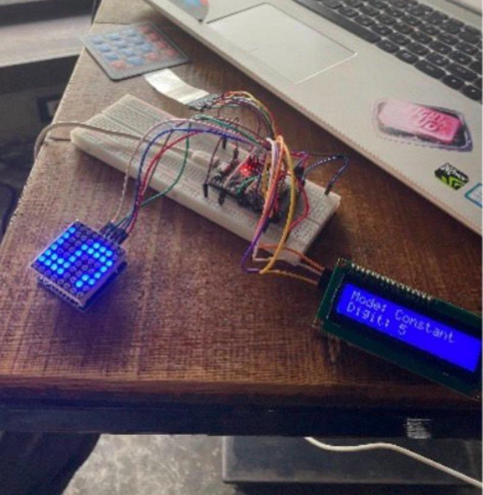
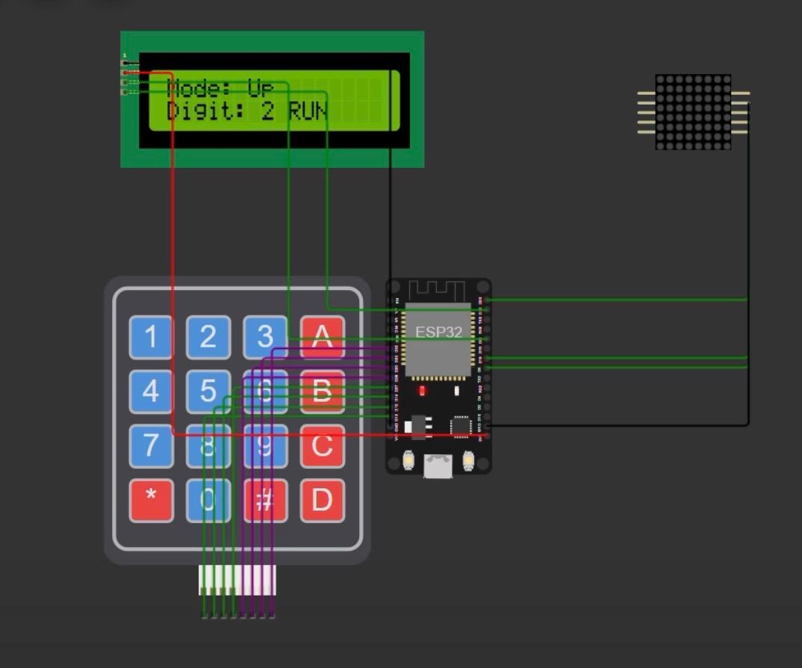
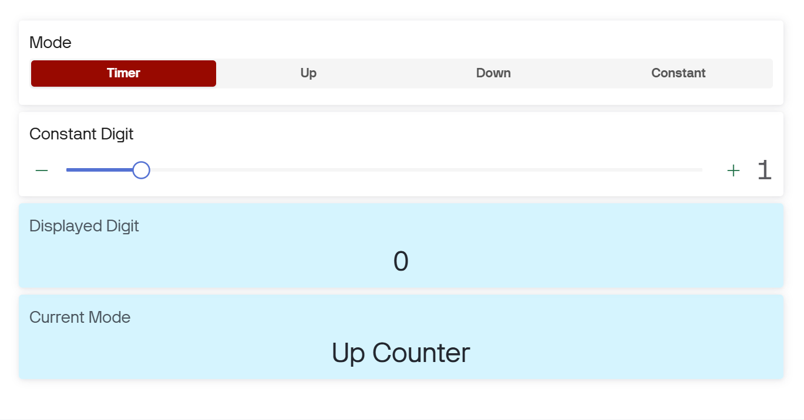

# ESP32 IoT Networked LED Matrix Display

A remotely controllable digit display built around an ESP32. An 8×8 LED matrix
shows digits 0–9, controlled two ways: locally with a keypad and LCD, and
remotely from a Blynk web/mobile dashboard over Wi-Fi. Both sides stay in sync
in real time through the Blynk cloud — changing the mode on the dashboard
updates the hardware instantly, and vice versa.

Built as a two-person course project (Advanced Networks, AASTMT, July 2025).
AI tools helped us write and debug parts of the Arduino code; we reviewed,
adjusted, and tested everything on real hardware until it worked as intended.

## Key features

- Four display modes: 10-second timer, up counter, down counter, and constant digit
- Two-way state sync: the physical device and the Blynk dashboard mirror each other live
- Local interface: 16×2 I2C LCD for status plus a 4×4 matrix keypad for control
- Remote interface: Blynk dashboard with mode buttons, a digit slider, and live readouts
- Digit rendering: each digit stored as an 8-byte pattern, written row by row to the MAX7219 driver
- Non-blocking timing with millis() and BlynkTimer, so network and inputs stay responsive

## Hardware

| Component | Role |
|---|---|
| ESP32-WROOM-32 | Main controller, Wi-Fi client |
| MAX7219 + 8×8 LED matrix | Digit display |
| 16×2 LCD (I2C, address 0x27) | Local status display |
| 4×4 matrix keypad | Local input |

### Pin connections

| Signal | ESP32 pin |
|---|---|
| MAX7219 DIN | 23 |
| MAX7219 CLK | 18 |
| MAX7219 CS | 5 |
| LCD SDA | 21 |
| LCD SCL | 22 |
| Keypad rows | 13, 12, 14, 27 |
| Keypad columns | 26, 25, 33, 32 |

## Blynk datastreams

| Pin | Direction | Purpose |
|---|---|---|
| V0 | App → device | Mode select (0 timer, 1 up, 2 down, 3 constant) |
| V1 | App → device | Constant digit value (0–9) |
| V2 | Device → app | Currently displayed digit |
| V3 | Device → app | Current mode name |

## How to run it

1. Install the Arduino IDE and add ESP32 board support (Boards Manager → "esp32" by Espressif).
2. Install these libraries via Library Manager: Blynk, LiquidCrystal I2C, Keypad.
3. In the Blynk Console, create a template with the four datastreams above, add a
   web dashboard (segmented switch on V0, slider on V1, value displays on V2 and V3),
   then create a device from the template to get your credentials.
4. Open code/LED_Matrix_ESP32/LED_Matrix_ESP32.ino and fill in your own values:

```cpp
#define BLYNK_TEMPLATE_ID   "YOUR_TEMPLATE_ID"
#define BLYNK_TEMPLATE_NAME "LED Matrix ESP32 Project"
#define BLYNK_AUTH_TOKEN    "YOUR_AUTH_TOKEN_HERE"

char ssid[] = "YOUR_WIFI_NAME";
char pass[] = "YOUR_WIFI_PASSWORD";
```

5. Wire the components as in the diagram below and upload the sketch.
6. The LCD shows "Connecting..." and then "System Ready" once online.

Keypad controls: 1 = timer, 2 = up counter, 3 = down counter, 4 = constant mode,
* = pause/resume. In constant mode, keys 0 and 5–9 set the digit directly.

Known limitation: in constant mode, digits 1–4 can only be set from the Blynk
slider, because keypad keys 1–4 are reserved for mode switching.

## Screenshots

Working hardware (constant mode, digit 5):



Wiring diagram:



Blynk web dashboard:



## Networking and security notes

- Architecture: the ESP32 acts as a Wi-Fi client that keeps a persistent
  connection to the Blynk cloud; the web/mobile dashboard is a second client.
  State flows both ways through virtual pins, so either side can control the other.
- The course covered MQTT's publish/subscribe model and transport security —
  plaintext MQTT on port 1883 versus TLS-encrypted MQTTS on port 8883. In this
  implementation, the Blynk library manages the cloud connection and the device
  authenticates with a per-device auth token.
- Credential hygiene: this repository contains no real secrets. Wi-Fi and Blynk
  credentials are placeholders, and the auth token used during development was
  rotated before publishing.

## What I learned

- Driving multiple peripherals from one microcontroller: I2C for the LCD,
  a shifted serial interface for the MAX7219, and matrix scanning for the keypad
- Keeping a physical device and a cloud dashboard in a consistent shared state
- Writing non-blocking embedded code so networking and inputs never stall each other
- Treating credentials as secrets: keeping them out of published code and
  rotating a token once it had been exposed
- Using AI as a coding assistant honestly — directing it, reviewing its output,
  and testing everything on real hardware

## License

MIT — see the LICENSE file.
